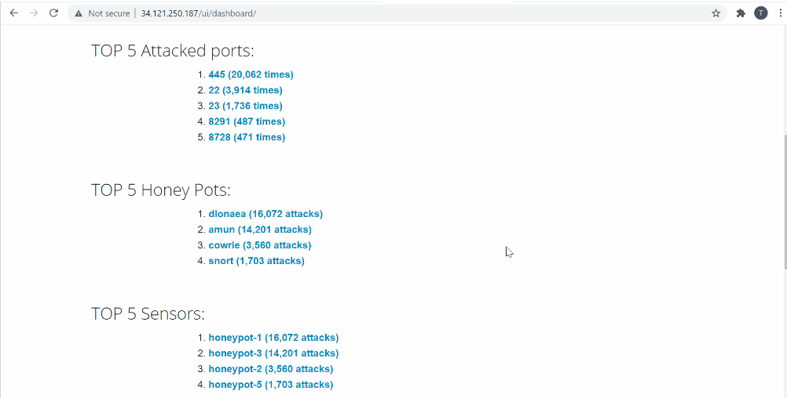
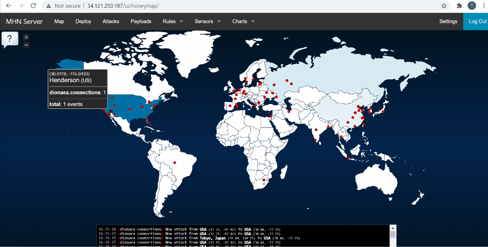
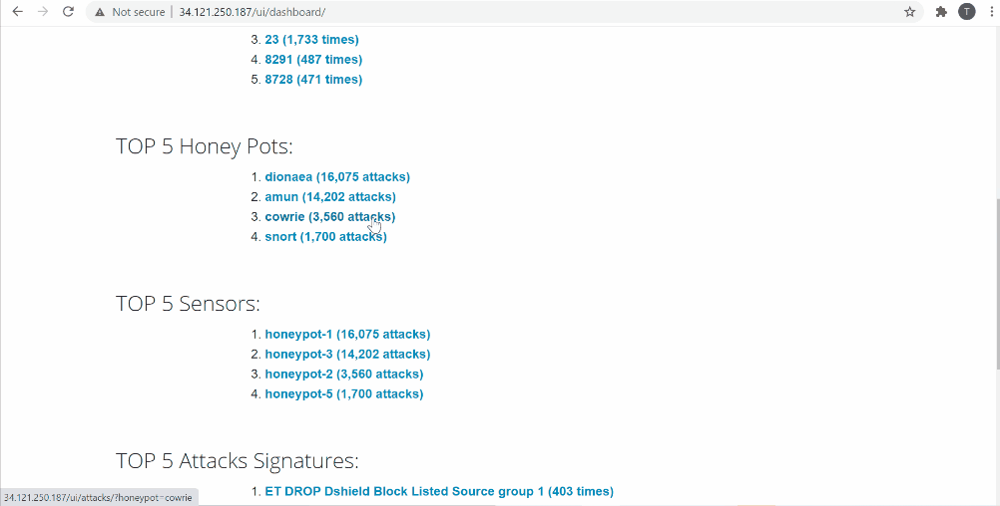
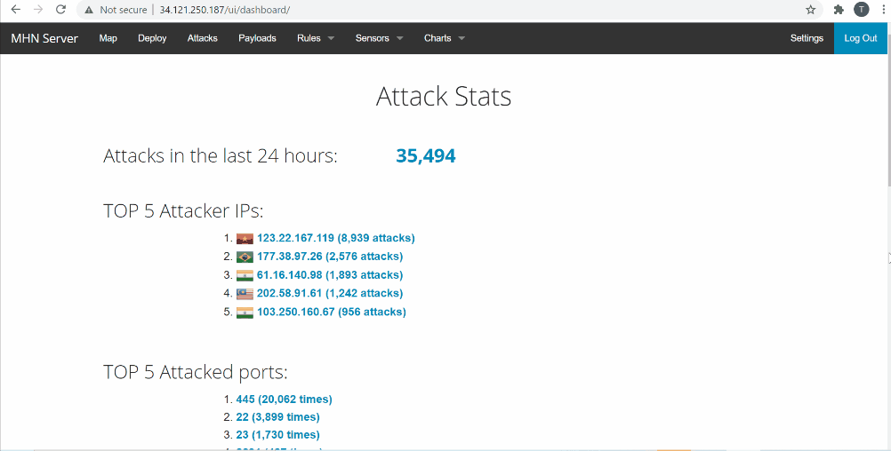
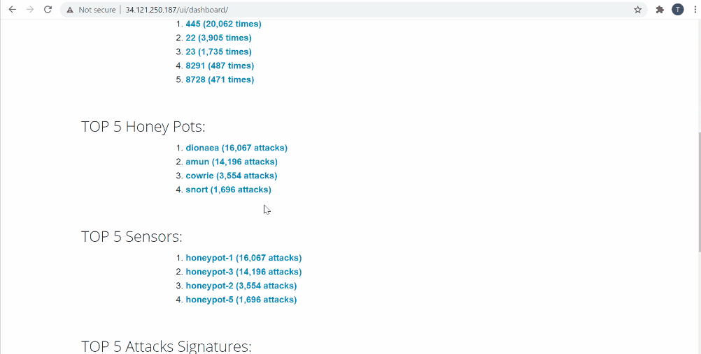

# Honeypot Assignment

**Time spent:** **18** hours spent in total

**Objective:** Create a honeynet using MHN-Admin. Present your findings as if you were requested to give a brief report of the current state of Internet security. Assume that your audience is a current employer who is questioning why the company should allocate anymore resources to the IT security team.

### MHN-Admin Deployment (Required)

**Summary:** How did you deploy it? Did you use GCP, AWS, Azure, Vagrant, VirtualBox, etc.?

I followed steps in Milestone 0 to 2.  I downloaded the GCP SDK and then I initialize it with gccloud. And then I created the MHN Admin VM via my cloud provider, and I setup the firewall rules by following the instructions. I did <gcloud compute ssh mhn-admin> to establish ssh access to the VM. I did the Milestone 2: Install the MHN Admin Application.

I used GCP to deploy the MHN-Admin [GCP](https://cloud.google.com/sdk/docs/quickstarts). I did 
<pre>
sudo apt update
sudo apt install git python-magic -y
</pre>
Next, I downloaded MHN and installed it:
<pre>
cd /opt/
sudo git clone https://github.com/pwnlandia/mhn.git
cd mhn/
</pre>

** Here I had to change FLASKSQLALCHEMY from 2.3.2 to 2.5.1
<pre>
sudo ./install.sh
</pre>

### Dionaea Honeypot Deployment (Required)

**Summary:** Briefly in your own words, what does dionaea do?

What dionaea does is that it aims to trap malware exploiting vulnerabilities exposed by services offered over a network, and ultimately obtain a copy of the malware.

### Database Backup (Required) 

**Summary:** What is the RDBMS that MHN-Admin uses? What information does the exported JSON file record?

The RDBMS that MHN-Admin uses is mnemosyne. The data collected from the honeypots that have been running for a while in my server. 

session.json is directly to this GitHub repo/branch (Honeypot)

### Deploying Additional Honeypot(s) (Optional)

#### Cowrie Honeypot

**Summary:** What does this honeypot simulate and do for a security researcher?

Cowrie simulate a ssh or telnet server, and will serve up a fake shell environment which can be tailored to resemble any kind of Linux distribution you like, with a fake directory tree and hosted files an attacker could examine or pillage. What Cowrie for a security research is that it enables the to logs password/username, track and log every command that the hacker types , and save what they download.

#### Amun Honeypot

**Summary:** What does this honeypot simulate and do for a security researcher?

Amun works by emulating a number of vulnerability modules,monitoring ports, and logging shellcode and downloads away for later analysis. What amun do for a security researcher is that it serves as a research tool that can track what hackers are trying to do.

#### Snort Honeypot

**Summary:** What does this honeypot simulate and do for a security researcher?

Snort monitors network traffic in real time, scrutinizing each packet closely to detect a dangerous payload or suspicious anomalies. What snort do for a security researcher is that they can see the compromised attempt beforehands and find ways to fix them. 

### Malware Capture and Identification (Optional)

#### X Malware

**Summary:** How did you find it? Which honeypot captured it? What does each malware do?

SHA1 Hash: *Run `sha1sum` on the file and record the hash here.*

## Notes

Signing up for the gcloud was a bit of a struggle at first.

First, Milestone 0 wasn't too clear so I had to research about how to set the time zone. I used a the following commands: 
gcloud config set compute/region us-central1
gcloud config set compute/zone us-central1-c
gcloud config list

MHN download MHN and install wasn't working so I did the troubleshooting that one of the TA answered on the slack channel and it worked. 

GIFs created with [ScreenToGif](https://www.screentogif.com/).

