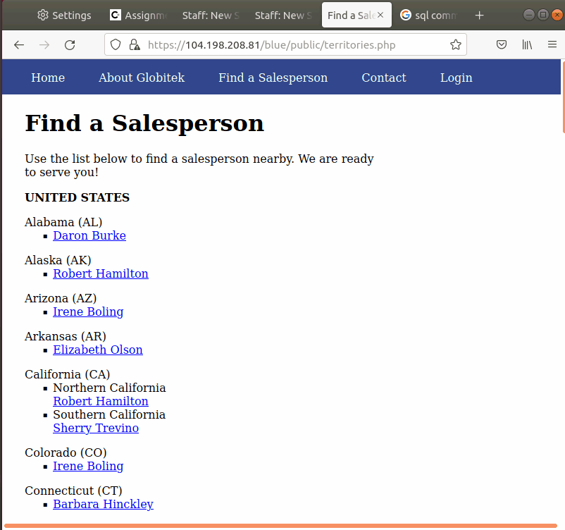

# Project 8 - Pentesting Live Targets

Time spent: **11** hours spent in total

> Objective: Identify vulnerabilities in three different versions of the Globitek website: blue, green, and red.

The six possible exploits are:

* Username Enumeration
* Insecure Direct Object Reference (IDOR)
* SQL Injection (SQLi)
* Cross-Site Scripting (XSS)
* Cross-Site Request Forgery (CSRF)
* Session Hijacking/Fixation

Each color is vulnerable to only 2 of the 6 possible exploits. First discover which color has the specific vulnerability, then write a short description of how to exploit it, and finally demonstrate it using screenshots compiled into a GIF.

## Blue

Vulnerability #1: SQL injection (SQLi)

Description: I inject this SQL command "%27%20OR%20SLEEP(10)=0--%27" as the idof the url. The website had to wait for some seconds while quering the data.

Vulnerability #2: 

Description:

## Green

Vulnerability #1: Cross site scripting

Description: I injected  to the input of feedback form of Contact tab which triggered an alert showing the message saying "An outsider found the XSS!".

Vulnerability #2: 

Description:

## Red

Vulnerability #1: IDOR

Description: When you change the id parameters of the user profile that isn't suppose to be made public until a given date in "Find a Salesperson", you are able to see its profiles in Red. But when you go in the others such as Blue and Green and input the id parameter of 10, it redirect you to the profile they have available. Red doesn't have the code that prevent important information from being made public.

Vulnerability #2:

Description:

## Notes

Describe any challenges encountered while doing the work

I first didn't know where to type the malicious input, but once I figured out how this works it I was able to find the vulnelabilities. The past assignment were obvious which attack we should use in which part of the webpage, but in this assignment we had to figure out all on our own so that was a little tricky.
